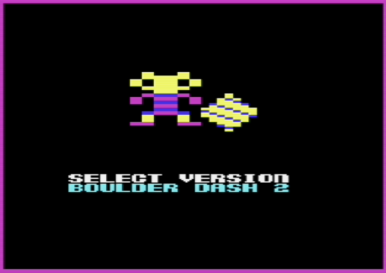
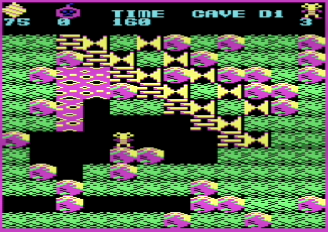

# Boulder Dash for the Commodore Vic20
This is a fan-developed version of Boulder Dash for the Commodore Vic20 with a 32K RAM expansion.
I recently ported the BBC/Acorn Electron version of Boulder Dash to the Oric so thought I'd try doing the same with the Vic20, my first computer.

This repo really contains 5 different versions of the game. They all run with the same 'game engine' but have different caves. Use the joystick to select the version from the first menu screen, then press fire to confirm.



- Boulder Dash, Boulder Dash 2 and Boulder Dash 3, are similar to the original games released for other platforms in the 1980's.




- Boulder Dash +1 contains two main enhancements not in the other versions, the use of bombs and having zero-gravity caves.


- Arno Dash 1 is one example of the many fan-developed caves found on [Arno's Boulder Dash fansite](https://www.boulder-dash.nl/). Boulder Dash format files (BDCFF) are used to create new caves which run with the game-engine.


## Emulation
[Vic Boulder Dash](./d64/Vic20%20Boulder%20Dash.d64) is available in the d64 folder.

It has been tested using the VICE emulator and on a real Vic20 (PAL version) with a 32K RAM expansion and joystick attached.

> VICE xvic.exe v3.3 settings
```
machine > model settings > VIC model > PAL
machine > model settings > RAM blocks > all ticked for max RAM
settings > machine > autostart settings > tick "Load to Basic start" for load"*",8 instead of 8,1
```
Set joystick mappings if required. Also see `bd_run.bat`.

There are some differences in this Vic20 version of the game.
- The visible screen size on this version is more limited than the original game although the overall map is same size. Only 12x12 tiles are visible in this version compared to 12x20 tiles in the original. This means Rockford cannot 'see' as many tiles to the left and right. This difference is most noticeable on the bonus screens which do not normally scroll but must in this version. Overall though it doesn't detract from the gameplay experience that much.
- The status bar is different as it shows the diamonds needed, reduced each time one is gathered. The diamond value is not shown. A count of the number of bombs available is included, as are the normal things such as time remaining, lives available and the player score.
- Different versions of Boulder Dash are selectable and all caves except the intermissions are selectable from the menu.
- The game includes basic instructions.
- Bombs and zero-gravity enhancements. These are only used in caves where they have been defined as cave parameters (see below for more details).

## Developer notes

### Build and run
The main program is `main.asm`. It includes other programs such as `spr.asm`, `vars.asm` and others which have been split out from the main program for development convenience.

`bd_build_all.bat` compiles the main program into a PRG file using `acme.exe`. It creates the cave PRG files for each version from the individual cave binary files previously generated from BDCFFs using `BDcavegen.py`. Then all PRG files including the compiled basic loader `bdload` are added into a D64 file using `create_d64.py`.

`bd_run.bat` loads the D64 file using the VICE emulator. The basic command `RUN` starts the game.

### Other things
Used as the basis for autoloading the main program using the keyboard buffer. Also see the basic loader `bdload.bas`.
> basic
```
5 rem loader pokes LO"BD",8{CR} into keyboard buffer
10 poke631,76:poke632,111:poke633,34:poke634,66:poke635,66
20 poke636,34:poke637,44:poke638,56:poke639,13:poke198,9
30 poke783,0:poke781,161:poke782,18:sys65436:sys58232
```

Used to understand how to test for specific keys in a keyboard scan.
> basic
```
5 rem test keyboard
10 poke37154,0:poke37155,255
15 rem poke37153,251 :rem isolate column with 6tfcxdr5
16 poke37153,253 :rem isolate column with 4esz(left-shift)aw3
20 printpeek(37152)
30 goto20
```

## Caves
- All 20 caves are available in memory (16 standard and 4 bonus caves). They each have the same size, 48 bytes used for parameters, 400 bytes for the map. Each tile in the map is a nibble (each byte represents two tiles). When a particular cave is about to be played, it is loaded into a section of memory labelled `cave_parameter_data`. See `cavedata.asm` for more details about the parameters available. 
- New cave files can be converted from BDCFF files found on [Arno's Boulder Dash fansite](https://www.boulder-dash.nl/) using a conversion utility `BDCavegen.py`.

## Acknowledgements
The following sources have all helped to make this development possible and is gratefully acknowledged.
- [Changing Screen Dimensions on the Commodore VIC-20](https://techtinkering.com/articles/changing-screen-dimensions-on-the-commodore-vic-20/) provides good examples and descriptions about using this screen sizing technique.
- The [Demo Maker G font](https://home-2002.code-cop.org/c64/font_05.html) was used for letters, numbers and symbols.
- The COMPUTE! Mapping the VIC book by Russ Davies is a great reference for understanding all those Vic20 memory locations.
- The Commodore Vic20 Programmer's reference guide helps with understanding how things are done on the Vic.
- The [Vic20 Denial / Sleeping Elephant website](https://sleepingelephant.com/) includes a number of helpful titbits and commentary.
- The [disassembly of the original BBC/Acorn Electron game](https://github.com/TobyLobster/Boulderdash) by TobyLobster was where this all started.
- [Arno's Boulder Dash fansite](https://www.boulder-dash.nl/) provided was the source of the BDCFF files used to create the caves. The Arno version 1 caves feature in this game, although there are many others available!